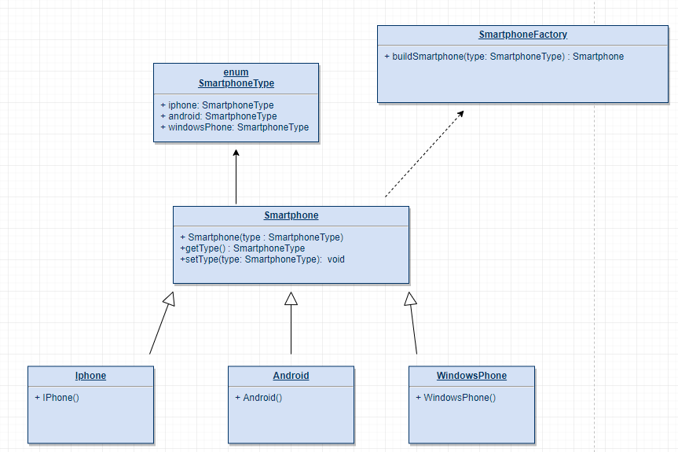
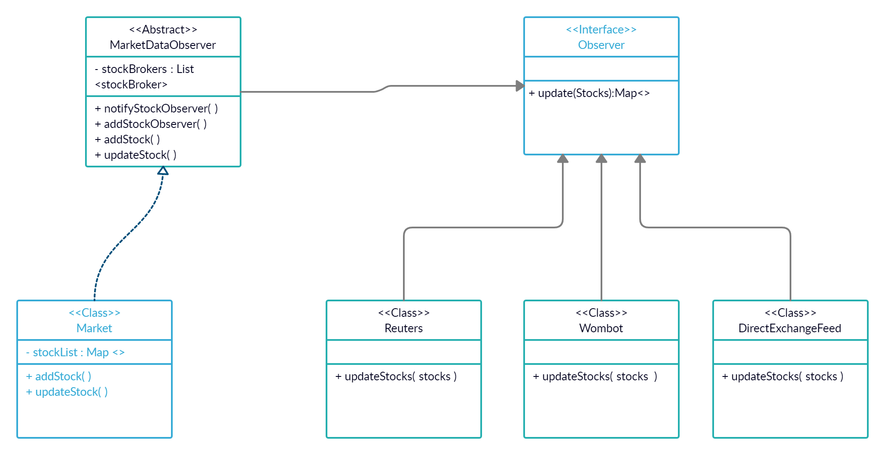

# Design Principles/Patterns Foundation

## Make a Class diagram for below 4 scenarioes and Name the Design pattern used.

1. You have a Smartphone class and will have derived classes like IPhone, AndroidPhone,WindowsMobilePhone, can be even phone names with brand, how would you design this system of Classes.



Factory Design Pattern 

- An enum which defines different types of Smartphones.
- Smartphone class has three children IPhone, Android and WindowsPhone.
- class SmartphoneFactory which defines buildSmartphone method for factory.


```java
public enum SmartphoneType {
    IPHONE, ANDROID, WINDOWSPHONE;
}
```
```java
public abstract class Smartphone {
    private SmartphoneType model;
    
    public Smartphone(SmartphoneType smartphoneType) {
        this.model = smartphoneType;
    }
    
    public SmartphoneType getModel() {
        return model;
    }
    public void setModel(SmartphoneType model) {
        this.model = model;
    }
    protected abstract String getMyOS(); 
}
```
```java
public class Iphone extends Smartphone {
    
    Iphone() {
        super(SmartphoneType.IPHONE);
    }
    @Override
    protected String getMyOS() {
        return "iOS";
    }
}
```
```java
public class SmartphoneFactory {
    public static Smartphone buildSmartphone(SmartphoneType type) {
        Smartphone smartphone = null;
        switch (type) {
            case IPHONE:
                smartphone = new Iphone();
                break;
            case ANDROID:
                smartphone = new Android();
                break;
            case WINDOWSPHONE:
                smartphone = new WindowsPhone();
                break;
        }
        return smartphone;
    }
}
```

<hr />

2.  Write classes to provide Market Data and you know that you can switch to different vendors overtime like Reuters,
wombat and maybe even to direct exchange feed , how do you design your Market Data system?



```
Observer Design Pattern used.
```
<hr />
3. What is Singleton design pattern in Java ? write code for thread-safe singleton in Java and handle Multiple Singleton cases shown in slide as well.


A singleton pattern is a software design pattern that restricts the instantiation of a class to one "single" instance. This is useful when exactly one object is needed to coordinate actions across the system.

```java
public class Singleton {

    private static Singleton INSTANCE = new Singleton();

    private Singleton() {}

    public static Singleton getInstance() {
        return INSTANCE;
    }
}
```


### Thread Safe Singleton

The easier way to create a thread-safe singleton class is to make the global access method synchronized, so that only one thread can execute this method at a time. General implementation of this approach is like the below class.


synchronize implementation - 
```java

public class ThreadSafeSingleton {

    private static ThreadSafeSingleton instance;
    
    private ThreadSafeSingleton(){}
    
    public static synchronized ThreadSafeSingleton getInstance(){
        if(instance == null){
            instance = new ThreadSafeSingleton();
        }
        return instance;
    }
    
}
```

Double-checked locking implementation -

```java
public static ThreadSafeSingleton getInstanceUsingDoubleLocking(){
    if(instance == null){
        synchronized (ThreadSafeSingleton.class) {
            if(instance == null){
                instance = new ThreadSafeSingleton();
            }
        }
    }
    return instance;
}
```

### Ways to handle multiple singleton classes

1. Reflection -
 
Reflection can be caused to destroy singleton property of singleton class.

To overcome issue raised by reflection, enums are used because java ensures internally that enum value is instantiated only once. Since java Enums are globally accessible, they can be used for singletons.

```java
public enum EnumSingleton {

    INSTANCE;
    
    public static void doSomething(){
        //do something
    }
}
```
2. Serialization - 

Serialization cause breakage of singleton property of singleton classes. Suppose you serialize an object of a singleton class. Then if you de-serialize that object it will create a new instance and hence break the singleton pattern.

To overcome this scenario all we need to do it provide the implementation of readResolve() method.

```java
protected Object readResolve() {
    return getInstance();
}
```

3. Cloning - 

Cloning is a concept to create duplicate objects. Using clone we can create copy of object. Suppose, we ceate clone of a singleton object, then it wil create a copy that is there are two instances of a singleton class, hence the class is no more singleton.

To overcome this issue, override clone() method and throw an exception from clone method that is CloneNotSupportedException. Now whenever user will try to create clone of singleton object, it will throw exception and hence our class remains singleton.

```java
 @Override
  protected Object clone() throws CloneNotSupportedException  
  { 
    return instance; 
  } 
```
<hr />

4. Design classes for Builder Pattern. 


