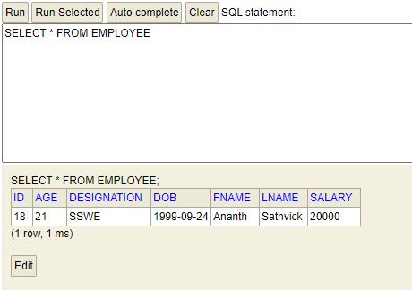

# Hibernate 1 assignment

Employee management
```
Employee{
    id
    fname
    laname
    age (length=2)
    salary
    DOB
    Designation
} 
```
Menu:
1. Create employee
2. Update all employee
2. Update employee by id
3. Delete employee - warning: this cannot be recovered
4. Get all employee
5. Get Employee by id
6. exit
Enter your choice (1-6)

Output - 

```
 Enter your choice 
1. Create Employee 
2. Update All Employee 
3. Update Employee by id 
4. Delete employee by id  
5. Get All Employee 
6. Get Employee by id
7. Exit
1
Enter First Name:
Ananth
Enter Last Name:
Sathvick
Enter Designation:
SWE
Enter DOB:
1999-09-24
Enter Age:
21
Enter Salary:
20000
Successfully saved....
Employee database 
 Enter your choice 
1. Create Employee 
2. Update All Employee 
3. Update Employee by id 
4. Delete employee by id  
5. Get All Employee 
6. Get Employee by id
7. Exit
2
Enter new designation you want to update
SSWE
Successful
Employee database 
 Enter your choice 
1. Create Employee 
2. Update All Employee 
3. Update Employee by id 
4. Delete employee by id  
5. Get All Employee 
6. Get Employee by id
7. Exit
5
|	id	|	 name 	| 	age	 | 	salary 	| 	DOB	 |	 Designation	 |
|	18	|	Ananth Sathvick	|	21	|	20000	|	1999-09-24	|	SSWE	|
Successfull
Employee database 
 Enter your choice 
1. Create Employee 
2. Update All Employee 
3. Update Employee by id 
4. Delete employee by id  
5. Get All Employee 
6. Get Employee by id
7. Exit
```

