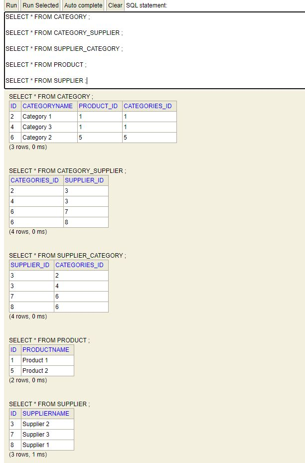
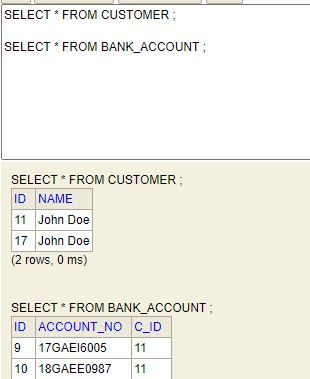

# Hibernate - 2 Assignment

## 1. Ecommerece
```
Product (product to categories is one-to-many)
Categories ()
Supplier (many to many with Categories)
```

Output - 
```
Hibernate: create table Category (Id integer not null, CategoryName varchar(255), product_Id integer, categories_Id integer, primary key (Id))
Hibernate: create table Category_Supplier (Categories_Id integer not null, supplier_Id integer not null, primary key (Categories_Id, supplier_Id))
Hibernate: create table Product (Id integer not null, ProductName varchar(255), primary key (Id))
Hibernate: create table Supplier (Id integer not null, SupplierName varchar(255), primary key (Id))
Hibernate: create table Supplier_Category (Supplier_Id integer not null, categories_Id integer not null, primary key (Supplier_Id, categories_Id))
Hibernate: alter table Category add constraint FKcjdt3qxxhrgg0i7hwkpxcqn7o foreign key (product_Id) references Product
Hibernate: alter table Category add constraint FK3cu5inbpa44xmnn1ahlj4k90a foreign key (categories_Id) references Product
Hibernate: alter table Category_Supplier add constraint FKnkby5odk3itv6uvor6disqqgj foreign key (supplier_Id) references Supplier
Hibernate: alter table Category_Supplier add constraint FKsmn42hnnd43d8dgce6p2dke10 foreign key (Categories_Id) references Category
Hibernate: alter table Supplier_Category add constraint FKe3n1279ou2cyxil5dqdb5vkyl foreign key (categories_Id) references Category
Hibernate: alter table Supplier_Category add constraint FKjxvbuejd4e4l3y4gfrt6n5053 foreign key (Supplier_Id) references Supplier
Hibernate: call next value for hibernate_sequence
Hibernate: call next value for hibernate_sequence
Hibernate: call next value for hibernate_sequence
Hibernate: call next value for hibernate_sequence
Hibernate: call next value for hibernate_sequence
Hibernate: call next value for hibernate_sequence
Hibernate: call next value for hibernate_sequence
Hibernate: call next value for hibernate_sequence
Hibernate: insert into Product (ProductName, Id) values (?, ?)
Hibernate: insert into Category (CategoryName, product_Id, Id) values (?, ?, ?)
Hibernate: insert into Supplier (SupplierName, Id) values (?, ?)
Hibernate: insert into Category (CategoryName, product_Id, Id) values (?, ?, ?)
Hibernate: insert into Product (ProductName, Id) values (?, ?)
Hibernate: insert into Category (CategoryName, product_Id, Id) values (?, ?, ?)
Hibernate: insert into Supplier (SupplierName, Id) values (?, ?)
Hibernate: insert into Supplier (SupplierName, Id) values (?, ?)
Hibernate: update Category set categories_Id=? where Id=?
Hibernate: update Category set categories_Id=? where Id=?
Hibernate: insert into Category_Supplier (Categories_Id, supplier_Id) values (?, ?)
Hibernate: insert into Supplier_Category (Supplier_Id, categories_Id) values (?, ?)
Hibernate: insert into Supplier_Category (Supplier_Id, categories_Id) values (?, ?)
Hibernate: insert into Category_Supplier (Categories_Id, supplier_Id) values (?, ?)
Hibernate: update Category set categories_Id=? where Id=?
Hibernate: insert into Category_Supplier (Categories_Id, supplier_Id) values (?, ?)
Hibernate: insert into Category_Supplier (Categories_Id, supplier_Id) values (?, ?)
Hibernate: insert into Supplier_Category (Supplier_Id, categories_Id) values (?, ?)
Hibernate: insert into Supplier_Category (Supplier_Id, categories_Id) values (?, ?)
```


## 2. Fix the problem in many to many for given example

Output - 
```
Hibernate: drop table if exists categories CASCADE 
Hibernate: drop table if exists categories_items CASCADE 
Hibernate: drop table if exists item CASCADE 
Hibernate: drop table if exists item_categories CASCADE 
Hibernate: create table categories (catid integer not null, catname varchar(10), primary key (catid))
Hibernate: create table categories_items (Categories_catid integer not null, items_itemid integer not null, primary key (Categories_catid, items_itemid))
Hibernate: create table item (itemid integer not null, itemname varchar(10), primary key (itemid))
Hibernate: create table item_categories (Item_itemid integer not null, categories_catid integer not null, primary key (Item_itemid, categories_catid))
Hibernate: alter table categories_items add constraint FKlfuhw28svppg9mnjlvm4ns9ja foreign key (items_itemid) references item
Hibernate: alter table categories_items add constraint FKaj050gmpgy0enslvk6o539k0p foreign key (Categories_catid) references categories
Hibernate: alter table item_categories add constraint FKsfnnx73ejgbemxm93jekinuwf foreign key (categories_catid) references categories
Hibernate: alter table item_categories add constraint FK5qfb9m8dc1xiccnkdlydb5spn foreign key (Item_itemid) references item
Hibernate: select item_.itemid, item_.itemname as itemname2_2_ from item item_ where item_.itemid=?
Hibernate: select item_.itemid, item_.itemname as itemname2_2_ from item item_ where item_.itemid=?
Hibernate: insert into categories (catname, catid) values (?, ?)
Hibernate: insert into item (itemname, itemid) values (?, ?)
Hibernate: insert into item (itemname, itemid) values (?, ?)
Hibernate: insert into categories (catname, catid) values (?, ?)
Hibernate: insert into categories_items (Categories_catid, items_itemid) values (?, ?)
Hibernate: insert into categories_items (Categories_catid, items_itemid) values (?, ?)
Hibernate: insert into item_categories (Item_itemid, categories_catid) values (?, ?)
Hibernate: insert into item_categories (Item_itemid, categories_catid) values (?, ?)
Hibernate: insert into item_categories (Item_itemid, categories_catid) values (?, ?)
Hibernate: insert into item_categories (Item_itemid, categories_catid) values (?, ?)
Hibernate: insert into categories_items (Categories_catid, items_itemid) values (?, ?)
Hibernate: insert into categories_items (Categories_catid, items_itemid) values (?, ?)
Many to Many using annotations done
```


## 3. Create an application for many to one other than sample example

Output - 
```
Hibernate: call next value for hibernate_sequence
Hibernate: call next value for hibernate_sequence
Hibernate: call next value for hibernate_sequence
Hibernate: insert into Bank_account (account_no, c_id, id) values (?, ?, ?)
Hibernate: insert into Bank_account (account_no, c_id, id) values (?, ?, ?)
Hibernate: insert into Customer (name, id) values (?, ?)
Hibernate: update Bank_account set account_no=?, c_id=? where id=?
Hibernate: update Bank_account set account_no=?, c_id=? where id=?
```

