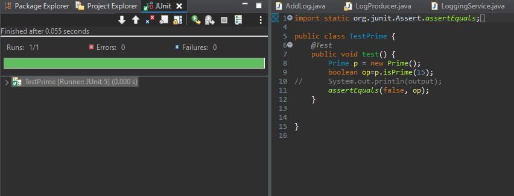
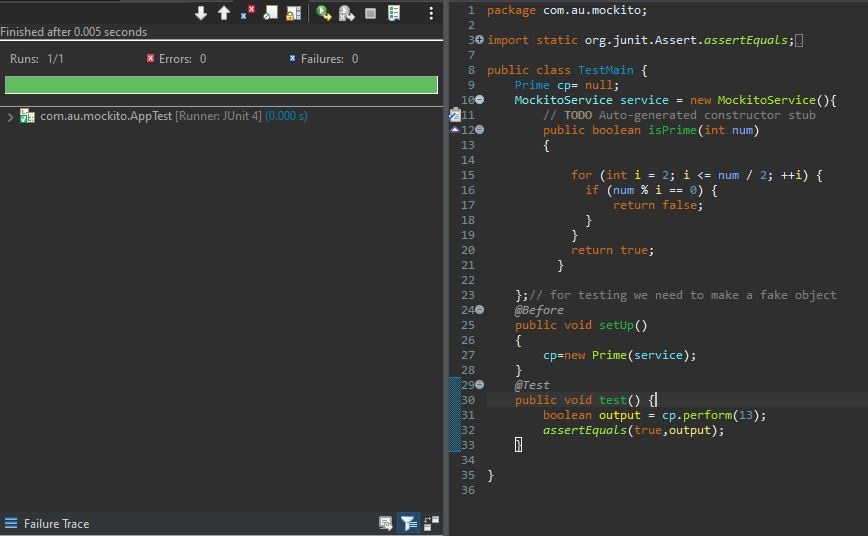
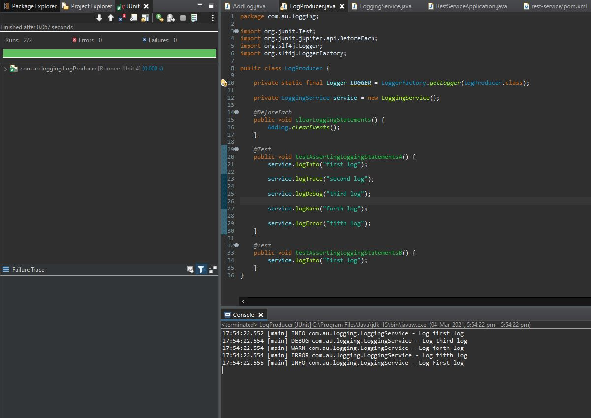

# Junit, Mockito, Logging

## 1. Junit 

Output - 



## 2. Mockito

Output -



## 3. Logging

Output - 

```
17:54:22.552 [main] INFO com.au.logging.LoggingService - Log first log
17:54:22.554 [main] DEBUG com.au.logging.LoggingService - Log third log
17:54:22.554 [main] WARN com.au.logging.LoggingService - Log forth log
17:54:22.554 [main] ERROR com.au.logging.LoggingService - Log fifth log
17:54:22.555 [main] INFO com.au.logging.LoggingService - Log First log
```


